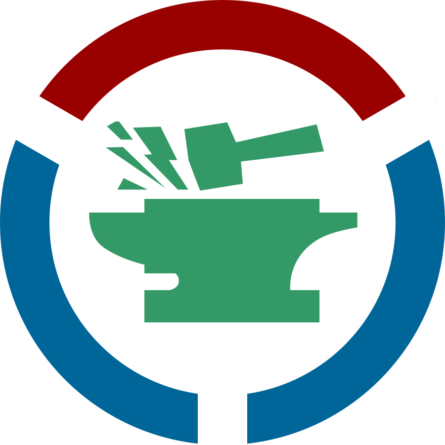
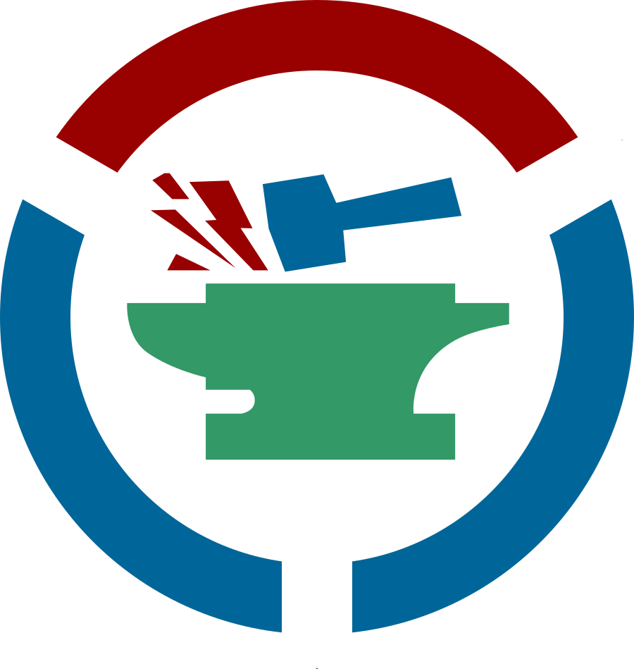
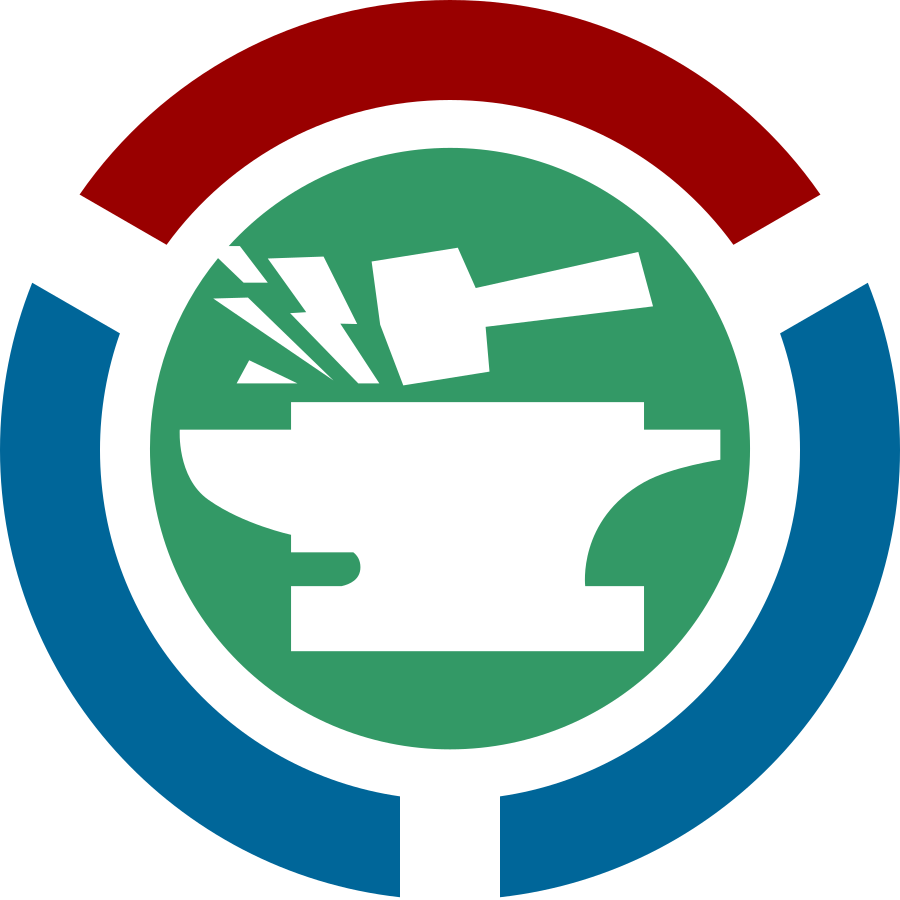
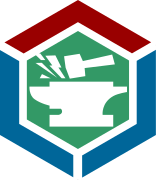
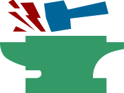
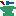

Toolforge logos
===============

Proposed logo designs for Wikimedia's Toolforge platform as a service product.

Hexagon versions are intended to be compatible with the [Hexagon sticker
standard]. These would not be used on-wiki, but would be printed as stickers
because all the cool projects are using hex stickers for better tiling.

Positive image of anvil
-----------------------

 

Positive image of tri-color anvil
---------------------------------

 

Negative image of anvil
-----------------------

 

Compact
-------

Tri-color anvil, hammer, and sparks for use in compact displays such as
a favicon. Images 48x48 pixels and smaller have been hand edited to simplify
the resulting image.

Credits
-------
Copyright © 2017, [Bryan Davis].

Licensed under a [Creative Commons Attribution-ShareAlike 4.0 International
License].

Images derived from:
* "[Wikimedia Community Logo]" by [Artur Jan Fijałkowski] - Own work, [Public Domain]
* "[Forge]" by [Monjin Friends] - Own work, [Creative Commons Attribution 3.0]

Favicons and related content generated using [RealFaviconGenerator].

[Hexagon sticker standard]: https://github.com/terinjokes/StickerConstructorSpec
[Wikimedia Community Logo]: https://commons.wikimedia.org/wiki/File:Wikimedia_Community_Logo.svg
[Artur Jan Fijałkowski]: https://commons.wikimedia.org/wiki/User:WarX
[Public Domain]: https://en.wikipedia.org/wiki/en:public_domain
[Forge]: https://thenounproject.com/term/anvil/1044767/
[Monjin Friends]: https://thenounproject.com/monjin.friends/
[Creative Commons Attribution 3.0]: https://creativecommons.org/licenses/by/3.0/us/
[Bryan Davis]: https://github.com/bd808/
[Creative Commons Attribution-ShareAlike 4.0 International License]: https://creativecommons.org/licenses/by-sa/4.0/
[RealFaviconGenerator]: https://realfavicongenerator.net/
